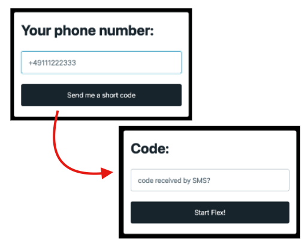

## Screenshots

Supervisor listing all the Agents:


Supervisor adding a new Agent:


Supervisor viewing the Audit Events


Agent logging in:

<p align="center" width="100%">
    
</p>

## What

This is a [Flex Plugin](https://www.twilio.com/docs/flex/developer/plugins) that allows the Supervisors of your Contact Center to add/remove Agents by their own without the need of having a SaaS Identity Provider (IdP) of the market to manage your Agents.

Of course, if you already have an IdP - especially the ones we support on our [SSO configuration Page](https://www.twilio.com/docs/flex/admin-guide/setup/sso-configuration#configure-your-identity-provider-to-support-twilio-flex) - it makes no sense to use this Plugin.

This plugin is meant for those companies who do not have an IdP and want to have Flex running as soon as possible!

**Disclaimer**: Ask your Developers to validate this Plugin, this is not production-ready code!

## How it works

This Plugin uses 100% of the Twilio Products and, therefore, makes it easy to have it running quickly!

- It uses [Twilio Functions](https://www.twilio.com/docs/runtime/functions) to orchestrate the SSO validation;
- It uses [Twilio Sync](https://www.twilio.com/sync) for storing the Agents;
- It uses [Twilio Verify](https://www.twilio.com/verify) to validate the authenticity of the Agents logging into Flex;
- It uses the new [Twilio Paste](https://paste.twilio.design) - which is the base for all future Flex Plugins;

## Oh, before installing it:

You need to enable [Flex UI 2.0](https://www.twilio.com/changelog/flex-ui-20-is-now-in-public-beta), the newest version of Flex!

## How to install

We have to install 2 assets:

- The Twilio Functions (back-end)
- The Flex Plugin (front-end)

#### To install the Twilio Functions:

1. clone this repo;
2. execute `cd ./serverless-sso` to go to the Twilio Functions folder.
3. `npm install` to install the packages into your computer.
4. rename `.env-example` from this folder to `.env` and follow the instructions in the `.env` file.
5. you have to generate the public/private pair keys for the SSO. Go to `./serverless-sso/src/assets` folder and execute the two commands below:

   ```
   openssl genrsa -out privatekey.private.cer 1024

   openssl req -new -x509 -key privatekey.private.cer -out publickey.private.cer -days 365
   ```

6. You should now have two new files in the `assets` folder: `privatekey.private.cer` and `publickey.private.cer`. You know the rules, don't send this private key to anyone.

7. `npm run deploy` to deploy the functions to your Twilio environment.

8. Quick test to see if you have done it correctly until here. Open Chrome and check if you can visit your `https://xxxxxx.twil.io/sso/saml` - Change the `xxxxxx` to your environment that was displayed in your Terminal from **step 7** above. You should see an error `ERR_REDIRECT_FLOW_BAD_ARGS`. For now, this means: **Success until here!**

9. Now go to [Flex SSO configuration](https://console.twilio.com/us1/develop/flex/manage/single-sign-on?frameUrl=%2Fconsole%2Fflex%2Fsingle-sign-on%3Fx-target-region%3Dus1) to configure the SSO you just deployed with Flex. Configure with the values below:

   - `X.509 CERTIFICATE`: Put the content of `./src/assets/publickey.private.cer` there.
   - `IDENTITY PROVIDER ISSUER`: `https://xxxxxx.twil.io/sso/saml`
   - `SINGLE SIGN-ON URL`: `https://xxxxxx.twil.io/sso/saml`
   - `DEFAULT REDIRECT URL`: Leave it blank.
   - `TWILIO SSO URL`: Use iam.twilio.com
   - `TRUSTED DOMAINS`: `xxxxxx.twil.io`
   - `Login using Popup`: `OFF`

   - Hit `Save` button

10. Final test: On this same [Flex SSO configuration](https://console.twilio.com/us1/develop/flex/manage/single-sign-on?frameUrl=%2Fconsole%2Fflex%2Fsingle-sign-on%3Fx-target-region%3Dus1) page, there is a link saying `Login with SSO`: Open this link in Incognito on your Browser, that is the link your agents will use to login on Flex. If everything goes right, you should see the Login page ([like this one](https://serverless-sso-6931-dev.twil.io/sso/login?id=blahtest&RelayState=blahtest)) - You can even try to log in, you should receive an error saying "Agent not found" - This is fine for now.

#### To install the Flex Plugin:

1. execute `cd ./flex-plugin-sso` to go to the Plugin folder.
2. `npm install` to install the packages into your computer.
3. rename `.env-example` from this folder to `.env` and follow the instructions in the `.env` file.
4. You need to have the [Twilio CLI](https://www.twilio.com/docs/twilio-cli/quickstart). Type `twilio` in your terminal to see if you have it, if not, install it now.
5. You need the [Flex Plugins CLI](https://www.twilio.com/docs/flex/developer/plugins/cli/install) . Type `twilio plugins` to make sure you have it, if not, install it.
6. You need to create a new profile for your Twilio CLI, type `twilio profiles:list` to check if you are using it correctly. If not, add a new profile with the cmd `twilio profiles:add`.
7. `npm run deploy -- --changelog "first deployment!"` to deploy this Plugin.
8. Once **step 8** is finished, it will show the next steps, you will have to run the command mentioned there (something like `twilio flex:plugins:release ... etc etc`)
9. We are done! Go to https://flex.twilio.com - You should see a new icon on the left-hand side. From there you can add/remove your Agents and ask them to visit the link mentioned on **step 10** to log in on Flex.

## Roadmap

- **[Feature]** multi-BPOs concept: on TeamView, for the Internal Supervisors, create a multi-select filter called "Company" similar to [this example](https://github.com/twilio-professional-services/plugin-team-view-filters), so Internal Supervisors can only see one of another BPO of their choice.

- **[Feature]** multi-BPOs concept: in RealTime Queue Dashboard, add the possibility to filter out only the queues from the BPO... Hiding the queues from others.

- **[Feature]** multi-BPOs concept: in the Flex Insights, add the possibility to have reports of their own BPO, using custom embedded dashboards.

- **[Tech Debt]** SSO - Check if we need to improve the security further (like validating the cert of Twilio side or encrypting the SAML messages)

- **[Tech Debt]** Find TODO on the code and work on those;
